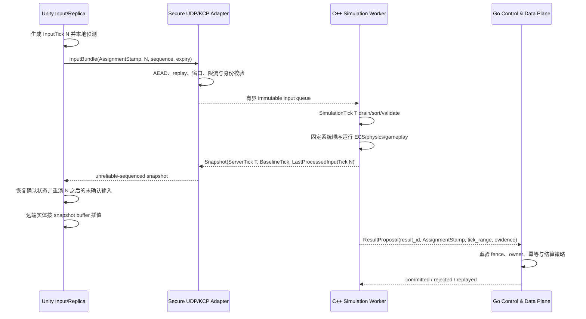

# Gameplay 模拟架构

## 目的与阶段边界

本文冻结 iHomeland gameplay 阶段的长期模拟模型，供后续 simulation model、network profile、C++ core、安全 UDP/KCP、Unity gameplay 和内容竖切 changes 共同遵守。首个可玩目标只包括：

- Owner 与少量 Visitor 在同一 PersonalWorld 探索；
- 移动、跳跃和基础地形/场景碰撞；
- 一把近战剑与一把远程扇子，技能由当前武器授予；
- 少量普通怪物与一只 Boss；
- 服务器权威伤害、死亡和协作结果。

`define-battle-network-profile` 已基于冻结模型和可重复 fault matrix 冻结 tick/snapshot cadence、MTU、插值/外推、历史、逻辑 raw/KCP lane 与预算；具体值见本文 B0.2 小节及机器可读 profile。本阶段仍不要求组队副本、匹配、战场、跨服、观战、完整录像或完整经济结算。

## 进程与实例身份

Go Control & Data Plane 继续拥有 PersonalWorld、WorldInstance placement、VisitSession、admission、持久事实和结算。C++ `Game Simulation Server` 只拥有已分配实例内的高频权威运行态。Unity 只保存输入、预测副本和表现。

```text
PersonalWorldID
  -> AssignmentStamp
       (WorldInstanceID, Generation, Lease/Fence, RuntimeNodeID)
       -> SimulationInstanceID
            -> SimulationWorld / ECS / Physics / Navigation / History
```

- `PersonalWorldID` 是 Go 持久身份，不能由 C++ 重新创建或解释。
- `AssignmentStamp` 是某次运行承载的完整 fence。所有 start、join、input、result 和 stop 都必须绑定它。
- `RuntimeNodeID` 在 C++ 模拟服落地后指向已注册、健康且可承载的 `SimulationNode`。
- `SimulationInstanceID` 是 C++ 内存实例身份，重启、迁移或 generation 变化时必须更换。
- 同一 PersonalWorld 最多一个 current writable `AssignmentStamp`；旧 generation 的 input、snapshot 与 result 全部 fail closed。

当前 Go `placement.RuntimeController` 是迁移接缝。后续 control change 以远程 adapter 替换本地 `processWorldRuntime`，不得删除 PersonalWorld/VisitSession owner，不得让 C++ 直连现有 repository，也不得在两端各自生成 assignment。

PersonalWorld 内暂态怪物、Boss 和战斗属于绑定当前 assignment 的 `SimulationInstance`。ActivityInstance 只在玩法拥有独立 lifecycle、admission、结果边界或匹配语义时出现，不是个人世界 gameplay 的前置条件。

## 状态同步与帧同步的项目术语

iHomeland 采用“服务器权威状态同步 + 帧编号输入/预测/校正/重演”的混合模型。这里使用帧同步技术，但不采用全世界确定性 Lockstep。

| 术语 | 本项目含义 | 不代表 |
|---|---|---|
| 状态同步 | C++ 发送带 `ServerTick`、baseline 与确认信息的权威 snapshot/delta，客户端据此收敛 | 客户端可以提交最终位置、命中或伤害 |
| 帧同步技术 | 输入带 `InputTick`，模拟按固定 `SimulationTick` 消费；客户端保留输入/预测历史并在确认后重演 | 所有客户端互相广播输入，或等待最慢客户端 |
| Lockstep | 多方在同一输入序列上产生确定性一致世界结果 | 本项目首期方案 |
| 客户端预测 | 本地玩家在收到确认前运行受限的移动/技能表现预测 | 客户端权威 |
| 权威校正 | 以 snapshot 的确认状态替换本地确认帧，再重演未确认输入 | 回滚整个服务器世界 |
| 远端插值 | 远端玩家、怪物和 Boss 在有界 snapshot buffer 上采样表现状态 | 在客户端运行权威 AI |
| 服务器历史帧 | C++ 保存的有界只读查询历史，用于延迟补偿、诊断和 evidence | 恢复已提交持久事实或任意时间旅行 |
| replay evidence | 可关联 build/config/tick/input/result 的诊断与争议证据 | 首期跨 C++/Unity 逐位确定性录像 |

## Tick、输入与权威快照

### Tick 语义

- `SimulationTick`：某个 SimulationInstance 的单调固定步长。初始化完成得到 `S0`，Tick `T` 只能从完整 `S(T-1)` 产生完整 `S(T)`；只有 simulation worker 可以推进。
- `InputTick`：客户端为本地预测输入分配的单调 tick；必须与 session、actor、sequence 和 expiry 共同验证。
- `ServerTick`：权威 snapshot/result 所对应的已完成 SimulationTick，始终标识该 Tick 提交后的状态。
- `LastProcessedInputTick`：服务器在该 snapshot 中已经接受并处理的本地玩家最大连续 InputTick。
- `BaselineTick`：delta snapshot 所依赖的完整或已确认 baseline；客户端没有该 baseline 时不得猜测应用。
- `SnapshotSequence`：同一网络 session 内的单调序号，用于丢弃旧的 unreliable-sequenced snapshot。

输入消息表达意图，例如移动轴、跳跃边沿、武器槽、瞄准方向和 ability activation；不得携带最终 transform、命中对象、伤害值、冷却完成或奖励。服务器在 tick boundary 对输入完成身份绑定、窗口验证、去重、排序和限量后进入模拟。

当前 mapping generation 内使用 checked integer arithmetic：

```text
mapped_tick =
  base_simulation_tick
  + floor((input_tick - base_input_tick) * input_step_ns / simulation_step_ns)
```

`LastProcessedInputTick` 只推进到已接受且已处理的最大连续 `InputTick`；gap、expiry、duplicate、旧 mapping generation 或旧 assignment generation 不得伪造连续确认。重连、迁移或 generation reset 必须建立新 mapping epoch，并拒绝旧 epoch 输入。B0.2 已冻结这些参数；C++、wire 与 Unity consumer 必须读取同一 profile，不得使用隐藏默认值。即使 profile 已完成，production UDP 仍必须等待 Go/C++ control、安全 transport 与真实网络资格。

### B0.1 冻结模型

权威 command vocabulary 只表达 `move-intent`、`jump-edge`、`switch-weapon`、`activate-ability` 等玩家意图；AI 产生同构的内部 intent。命令按 `target_tick -> actor_id -> input_tick -> sequence -> kind` 规范排序，网络 arrival order 不能改变裁决。payload 中的 transform、命中、伤害、effect、死亡与奖励声明一律无效。

每类 mutation 只有一个 pipeline owner：

| 状态 | 唯一 mutation owner |
|---|---|
| transform、velocity、grounded | Movement/Physics |
| ability grant、phase、cost、cooldown | AbilityActivation |
| hit 与 projectile lifecycle | HitDetection 与 deferred structural barrier |
| effect、attribute、damage、death cause | Effect、Attribute、Death |
| AI target、state、Boss phase | AIIntent；phase change 下一 Tick 生效 |
| snapshot、history、evidence projection | Replication/History，只读消费 gameplay 状态 |

首版模型还冻结以下行为：

- 移动采用整数单位、输入 clamp、显式 acceleration/deceleration/gravity，以及稳定 slope/step/collision 裁决；相同 hit fraction 再按 `ColliderID`、`SubshapeID` 排序。
- 剑在 active Tick 做 sweep，并按 activation-target 去重；扇子延迟提交 projectile spawn，下一 Tick 才移动，首次阻挡后终止。Gameplay Cue 只拥有表现，不拥有伤害事实。
- Attribute 使用 signed 64-bit scaled integer；乘法回到 scale 时 toward zero。Effect 的 modifier、stack、refresh、expiry、immunity 和同 Tick 多伤害使用固定顺序，溢出配置在实例启动前拒绝；Death 只提交一个稳定 cause。
- 普通怪物与 Boss 的 idle/acquire/chase/attack/recover/dead、threat/distance/ActorID tie-break 和 entity-local PRNG stream 均由服务端驱动；一个实体的随机消费不能扰动另一个实体。
- 历史只保存满足查询所需的最小有界投影；future tick 被 clamp，过期、缺帧或旧 generation 明确拒绝。补偿查询在当前 Tick 结算，不回写历史。
- player、projectile、effect、command、query、history 与 deferred buffer 都有硬容量。超限命令稳定拒绝并保留截断证据；hard Tick debt 触发有界 drain 请求，不允许无限追帧。
- 确定性比较基于规范化的 query/state/event/rejection/capacity token 与 SHA-256；不得依赖 hash-map、pointer、callback、线程调度或第三方类型迭代顺序。

机器可读 source of truth 位于 [Battle Simulation Model Fixtures](../shared/contracts/fixtures/battle/model/README.md)。`schema.json`、`manifest.json`、`assumptions.json` 与 cases 由只读 validator 验证；它们供 B0.2 profile 和后续无网络 C++ harness 消费，不是 wire schema，也不分配 message ID、lane、listener 或第三方依赖。

### B0.2 冻结 network profile

机器可读 source of truth 位于 [Battle Network Profile](../shared/contracts/fixtures/battle/network-profile/README.md)。Profile 绑定完整 `battle-model-v1` manifest、assumptions 和 10 个 case digest；任何 model 漂移都会使资格 fail closed。当前冻结参数如下：

| 类别 | 冻结值 |
|---|---|
| Tick | `SimulationTick=50 ms`（20 Hz），`InputTick=25 ms`（40 Hz），整数比例 2:1 |
| 输入窗口 | early 2 Tick、late/gap expiry 6 Tick、continuous hold 4 Tick、bundle depth 3、redundancy 2 |
| Snapshot | 每 2 SimulationTick（10 Hz）；每 10 个 snapshot 建立 full baseline |
| 历史与 baseline | history 16 Tick（800 ms）；baseline 最大 40 Tick（2 s），fan-out 10 |
| 客户端表现 | interpolation 100 ms、maximum extrapolation 150 ms、position correction 80 mm、angle correction 2° |
| Datagram | 最大 1200 bytes；保守预留 IPv6/UDP 48、secure session 48、AEAD tag 16、raw/KCP header 16/24 bytes，logical payload 上限分别为 1072/1064 bytes |
| 默认容量 | 1 Owner + 4 Visitor 必须通过；当前 profile qualified maximum 为 8 actors |
| 兼容容量 | 33 actors 已评估但标记 `capacity-gated`；后续 battle admission owner 为 `go-simulation-control-admission` |
| 预算 | 上行 16 KiB/s/player、下行 64 KiB/s/player、下行 512 KiB/s/instance、CPU 2.5 ms/Tick target、instance memory 64 MiB target、history 8 MiB target、queue 256 items |

CPU、allocator/memory、真实 codec size、真实 socket、AEAD 和 KCP adapter parity 仍是 `implementation_required`；上述 target budget 不是伪造的实现测量。Profile 用 6 个 cases、12 个 fault scenarios 和 24 个结果覆盖 latency、jitter、loss/burst、reorder、duplicate、baseline gap、MTU、KCP retransmit、queue、slow consumer 与 disconnect/drain；28 项隔离失败回归证明摘要、coverage、lane、预算、安全字段和连续只读重放门。

`message-inventory.json` 只冻结 `battle.input.bundle`、full/delta snapshot、probe、entity lifecycle、reliable ability event 与 resync 的 logical kind、direction、唯一 raw/KCP lane、expiry、size/rate 和恢复语义。它不是 production registry，不分配 numeric message ID、`.proto`、wire header、listener 或端口；这些仍由安全 transport change 一次性交付并做 parity。

### 输入 history 与预测 history

Unity 为本地受控 actor 保存有界：

- `InputHistory<InputTick, InputIntent>`；
- `PredictedStateHistory<InputTick, PredictableState>`；
- 已接收 snapshot/baseline 索引；
- 当前 `LastProcessedInputTick` 与 reconciliation generation。

历史必须有容量、时间和 generation 边界。重连、assignment 变化、actor respawn 或 hard reset 必须清空旧 history，不能把旧 generation 输入重演到新实例。

C++ 为每个连接保存有界输入窗口，只接受允许窗口内、通过 replay protection 且尚未消费的输入。网络 I/O 线程只把验证后的不可变输入写入有界队列；simulation worker 在 tick boundary drain。

### 客户端校正

收到本地 actor 的权威 snapshot 后：

1. 验证 session、assignment、instance、snapshot sequence 和 baseline。
2. 丢弃旧 generation、旧 sequence 或缺失 baseline 的 delta，并按协议请求允许的恢复路径。
3. 取 `LastProcessedInputTick` 对应的权威可预测状态。
4. 若误差在 profile tolerance 内，平滑表现但仍更新确认点。
5. 若超出 tolerance，恢复权威确认状态。
6. 按 InputTick 顺序重演所有尚未确认输入。
7. 丢弃已确认历史，并保持容量上限。

校正只作用于本地可预测子集，例如胶囊位置、速度、grounded、受限 movement mode 和已明确支持预测的 ability phase。生命、伤害、怪物 AI、掉落、奖励和持久 mutation 始终消费服务器结果，不在客户端回滚推导。

### 远端插值

远端玩家、怪物、Boss 和多数投射物进入有界 interpolation buffer。渲染时间落后最新已知 ServerTick 一个由 profile 确定的延迟，在相邻样本间插值；短缺样本时只允许有界外推，超过上限后冻结或进入降级表现。Animator、VFX 与 Camera 读取插值后的 view state，不能回写 authoritative replica。

## 输入、模拟、确认与重演时序



KCP 只承载“丢失不可接受且到达稍晚仍有意义”的有界消息，不承载连续 snapshot。输入是否走 raw lane、KCP lane，或按类别拆分，必须由 network profile 和 registry 逐 message 冻结，不能由调用方动态选择。

## 服务器历史帧与 replay evidence

### 有界历史帧

C++ 对需要延迟补偿的实体保存按 ServerTick 索引的最小历史投影，例如 capsule/碰撞形状、位置、朝向、姿态标记和必要 ability/tag 状态。历史不是完整 ECS clone；每类查询必须声明：

- owner system 与可查询字段；
- 最大回看 tick/window；
- 发起者可声明的 client-observed tick 及服务器 clamp 规则；
- 参与查询的 collision layer 与过滤策略；
- 过期、缺帧、assignment 变化和 overload 时的确定失败语义。

近战挥击、扇子投射/射线等延迟补偿查询只在服务器进行。客户端时间只能作为经过映射和 clamp 的证据，不能指定任意回溯点。查询结果仍在当前 tick 的 damage/effect pipeline 提交，不修改历史世界。

### Evidence 最小元数据

诊断或争议 evidence 至少关联：

- server build/version 与 protocol compatibility version；
- gameplay config version/hash、map/navmesh/physics material version；
- SimulationNodeID、SimulationInstanceID 与完整 AssignmentStamp fingerprint；
- UTC 时间范围、ServerTick/InputTick 范围与 tick duration profile；
- 已归一化的输入命令序列、随机种子/stream identity；
- authoritative event/result IDs 与状态摘要 hash；
- 丢包、乱序、RTT、queue pressure、correction 等低敏网络指标；
- evidence schema version、截断原因和完整性校验。

Evidence 必须有访问控制、保留期、大小上限和敏感字段清洗。不得记录账号凭据、raw ticket、AEAD key、完整聊天或不必要的个人数据。

replay/evidence 只用于重放模拟、回归、诊断和审核。它不能直接写 MySQL、恢复已提交奖励、撤销结算或成为第二个 settlement owner。若重放发现差异，输出诊断结果并交由 Go owner 通过独立补偿流程处理。

## 固定模拟管线与并发

每个 `SimulationWorld` 在任一 tick 只有一个 simulation worker 写 ECS 与 physics world。socket/timer、控制面和持久结果 I/O 可以并发，但只能通过有界 immutable queue 与 simulation worker 交换消息。

首期固定系统顺序：

```text
DrainInput
-> InputIntent
-> AIIntent
-> AbilityActivation
-> Movement
-> Physics
-> HitDetection
-> Effect
-> Attribute
-> Death
-> Replication
-> CommitDeferredStructuralChanges
```

不允许 system 在遍历 component storage 时直接 create/destroy entity 或 add/remove component。结构变化、spawn、despawn 和跨系统请求写入 typed deferred command buffer，在明确 barrier 按稳定顺序提交。输入、AI、物理 callback 和网络 ack 不得绕过 pipeline 直接改 gameplay component。

首期一个 worker 可承载一个或少量实例，按测量决定实例装箱。不得预建每实体线程、通用并行 scheduler、work stealing job system 或无 profile 依据的 lock-free graph。

## 自研最小 ECS

项目不引入 EnTT。首版 ECS 只解决服务端内存组织、生命周期与固定系统迭代：

- index + generation 的 `EntityID`，拒绝 stale handle；
- 每个 SimulationWorld 独立 registry 与 component storage；
- sparse-set 或由 benchmark 证明等价的紧凑 storage；
- 类型安全 `add/remove/get/has`；
- 满足已知系统的最小 view/query；
- typed deferred structural command buffer；
- 显式固定 system pipeline；
- world reset、只读 debug dump、测试 snapshot 与确定性 harness；
- 清晰的容量、内存、迭代失效和线程所有权契约。

ECS 不拥有网络、持久化、配置加载、结算或 gameplay 语义。首期禁止加入：

- archetype graph、反射、query DSL 与编辑器；
- 任意 component 自动序列化或自动网络复制；
- 通用 event bus、service locator、plugin ABI 或脚本 VM；
- 通用 Job Scheduler、多线程 system graph；
- 为未来可能需求设计的继承层级和万能 interface。

系统依赖显式 component/view 和窄 ports。只有出现第二个真实用例、benchmark/复杂度证据和独立 OpenSpec change 时，才扩展 ECS 能力。

### 《守望先锋》GDC 思想的项目化取舍

参考资料中的核心价值不是复制类名或代码，而是用约束降低持续增长的 gameplay 复杂度。《守望先锋》架构分享强调 World/Entity/Component/System、状态与行为分离、System 只关注所需 component slice，并把重要副作用收口到清晰调用点；其网络部分进一步展示了服务器权威、客户端输入/瞄准、预测与最终收敛。[架构与网络同步资料](https://www.lfzxb.top/ow-gdc-gameplay-architecture-and-netcode/)

iHomeland 选择吸收：

- component 主要保存状态，行为集中于明确 system/pipeline；
- 同类 mutation 只有一个 system owner，避免多个 utility/callback 暗中写同一事实；
- spawn/despawn、effect apply、cue 等高副作用行为先记录，再由固定阶段有界提交；
- 客户端本地 actor 使用受限预测，远端 actor 使用 snapshot 插值，最终以服务器结果收敛；
- 网络复制由明确 contract/registry 决定，不把整个 ECS 内存布局当 wire schema；
- replay/evidence 复用稳定 tick、输入、版本和结果记录，但与在线 world 和结算 owner 分离。

武器与技能分享展示了数据驱动状态、生命周期清理、服务器权威及客户端预表现的价值，但也包含专用可视化脚本运行时。[武器与技能系统资料](https://www.lfzxb.top/ow-gdc-weapon-and-skillsystem/) 首期 iHomeland 只用 typed C++ GAS-like specs/effects 和版本化配置表达剑、扇子、怪物与 Boss，不实现 Statescript、反射编辑器、脚本 VM、自动网络状态机或客户端完整规则副本。等真实内容生产证明硬编码/typed data 已成为瓶颈后，再以独立 change 评估 authoring tool。

因此，“像《守望先锋》”在本项目中指可验证的设计原则，不指复制其 60Hz、组件数量、协议、脚本语言、回放实现或客户端/服务器对称结构。

## GAS-like 与 ECS 的组合

GAS-like 是建立在 ECS 上的玩法能力语义，不是第二套 ECS，也不是 UE GAS 的逐 API 移植。

| GAS-like 概念 | 服务器表示与职责 |
|---|---|
| `AttributeSet` | ECS components 中的生命、攻击、防御、韧性、资源等当前值与约束 |
| `GameplayTag` | 稳定 ID 表示的状态、免疫、武器、控制和条件语义 |
| `AbilityGrant/AbilitySpec` | 当前已授予能力、等级、输入槽、激活状态和预测 identity |
| `GameplayEffect` | 即时、持续、周期性 modifier 与 tag grant/remove |
| `Cooldown/Cost` | 在权威 tick 上验证并提交的冷却和资源消耗 |
| `GameplayCue` | 由权威或已许可预测事件触发的跨端表现提示，不是伤害事实 |

玩家、怪物、Boss 和投射物仍是 ECS entities。Ability/Effect 可使用稳定 handle 或有界临时 entity，但只能经 `AbilityActivation -> Effect -> Attribute -> Death` 系统修改 components。武器负责授予/移除 ability specs：首期剑提供近战能力，扇子提供远程能力；切换武器不得复制一份角色属性 owner。

服务器拥有：

- grant、activation、target validation、cost、cooldown、effect stacking；
- 命中、伤害、免疫、死亡和 authoritative Gameplay Cue source；
- AI 能力选择与 Boss phase 规则；
- 可结算 result proposal 的证据。

Unity 的“客户端半套 GAS-like”只拥有：

- 输入到 ability command 的映射；
- 明确标记可预测的 activation/cast/movement 表现；
- authoritative ability/effect/tag/attribute replica；
- cooldown、resource 和 cue 的 UI/View projection；
- 预测被接受、拒绝或校正时的表现收敛。

Unity 不复制服务器完整 effect stacking、damage formula、target validation、AI 或结算规则。纯 C# gameplay replica 可以按 feature 组织 model/history/reconciliation，不需要完整客户端 ECS；Actor View、Animator、VFX、Audio 和 Camera 只消费 view state。

## 第三方库与构建边界

| 依赖 | 允许职责 | 项目 adapter 边界 | 禁止扩散 |
|---|---|---|---|
| Asio | UDP socket、endpoint、timer、异步 I/O | `DatagramTransport`/clock/reactor adapter | gameplay system 直接持有 socket、executor 或 Asio error type |
| Jolt | 碰撞查询、角色/刚体和场景物理 | `PhysicsWorld`、shape/query/result value types | ECS component、协议或 ability 公开 Jolt handle/type |
| Recast/Detour | Recast 离线生成 nav data；Detour 运行时 path query | `NavigationWorld` 与版本化 nav asset | AI 规则写进库 callback，或在 tick 内动态烘焙全图 |
| KCP core | 有界可靠有序 ARQ | 项目拥有 conversation/session、clock、output、expiry 与 congestion budget 的 adapter | KCP 创建 socket、管理账号 ticket、AEAD 或选择业务路由 |
| CMake | C++ target、依赖、测试、安装和工具链编排 | 根 `CMakeLists.txt` 是构建源事实 | 手工维护 IDE project 成为唯一构建入口 |
| CMake Presets | development、test、sanitizer、CI 的可重复 configure/build/test 参数 | checked-in presets 引用环境提供的工具链/缓存位置 | 提交本机绝对路径、密钥或个人 IDE 状态 |

依赖“只移植源码片段”通常会失去上游修复、许可证边界和升级路径，默认不采用。可选方式是受版本控制的 package/submodule/fetch source 或经批准的最小 vendoring；无论哪种方式，都必须保留上游版权/许可证并记录补丁。

首次引入每个依赖的 implementation change 必须在 `versions.yaml` 和 `docs/technology-versions.md` 登记：

- 精确版本、上游 source、checksum/tag/commit 与许可证；
- 获取/缓存/离线构建方式，支持的平台与编译器；
- adapter owner、允许 API surface、补丁列表与升级/回滚步骤；
- license/security review、最小 smoke/contract test；
- C++ 与 Unity/Go wire fixture 的兼容性门禁。

本架构 change 不选择精确版本、不下载库、不创建 CMake 工程，也不开放 listener。

## 首个可玩竖切的完成定义

完成以下行为才算 gameplay vertical slice，而不是“基础设施已完成”：

1. Owner 经现有 Go 流程进入自己的 PersonalWorld，Go 将 current AssignmentStamp 绑定到一个 C++ SimulationInstance。
2. Unity 经安全 admission 建立 battle session，在网络模拟条件下完成移动、跳跃、预测、校正和远端插值。
3. Visitor 经现有 VisitSession 进入同一 assignment；Owner 断线、过期、迁移与 safe-return 不产生双实例或旧 fence 写入。
4. 剑与扇子的 ability、cost/cooldown、命中、伤害和 cue 由权威 pipeline 驱动。
5. 普通怪物和 Boss 使用服务端 AI/navigation/physics；客户端不能提交命中、血量或奖励。
6. 网络资格覆盖丢包、乱序、重复、延迟、抖动、重连、攻击流量、带宽与 queue pressure。
7. evidence 可把一次异常关联到 build/config/assignment/tick/input/result，但不能自行结算。

详细变更顺序、进入条件与验收产出见 `docs/roadmap.md`。
